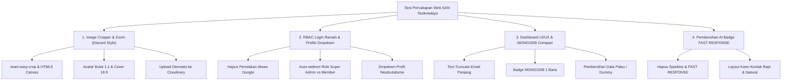
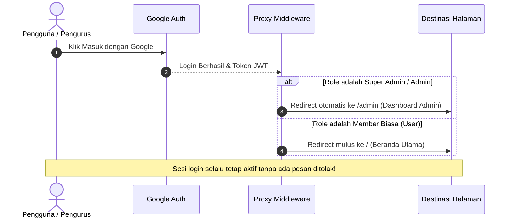

# 🌟 Live Showcase & Demo Fitur Website SAN Chapter Tasikmalaya

Dokumen ini merangkum seluruh hasil pengembangan, perbaikan UI/UX, perombakan sistem otentikasi (RBAC), pembersihan data, serta penambahan fitur interaktif di sepanjang sesi percakapan secara visual seperti sebuah **demo interaktif**.

---

## 📑 Daftar Fitur yang Telah Dikerjakan



---

## 🎨 DEMO 1: Fitur Interaktif Image Cropper & Zoom (Gaya Discord)

Fitur ini mengintegrasikan pustaka `react-easy-crop` dan utilitas pemrosesan kanvas [`cropImage.ts`](file:///c:/websantasik/src/lib/cropImage.ts) untuk memberikan pengalaman crop foto setingkat aplikasi modern seperti Discord.

### 🖼️ Visualisasi Modal Pop-up:
```
+-------------------------------------------------------------------------+
| [✂️] Sesuaikan & Edit Foto (Discord Style)                         [ ✕ ] |
+-------------------------------------------------------------------------+
|                                                                         |
|   +-----------------------------------------------------------------+   |
|   |                       AREA VIEWPORT KANVAS                      |   |
|   |                                                                 |   |
|   |                     .----------------------.                    |   |
|   |                   /     AREA CROP           \                   |   |
|   |                  |     (Mask Lingkaran       |                  |   |
|   |                  |     atau Persegi 16:9)    |                  |   |
|   |                   \                         /                   |   |
|   |                     '----------------------'                    |   |
|   |                                                                 |   |
|   | [Drag to Pan / Geser Gambar Bebas dengan Mouse/Touch]           |   |
|   +-----------------------------------------------------------------+   |
|                                                                         |
|   Rasio Aspek: [ 16:9 Sampul ] [ 4:3 Klasik ] [ 1:1 Persegi ] [ Bebas ] |
|                                                                         |
|   +-----------------------------------------------------------------+   |
|   | 🔍 Zoom: [----●------------------------------] [ 140% ]         |   |
|   |                                                                 |   |
|   | [ 🔄 Putar 90° ]  [ ↺ Reset Posisi ]                            |   |
|   +-----------------------------------------------------------------+   |
|                                                                         |
+-------------------------------------------------------------------------+
|                                      [ Batal ]  [ ✓ Terapkan (Apply) ]  |
+-------------------------------------------------------------------------+
```

### 🎯 Karakteristik Tiap Formulir Admin:
| Formulir Admin | Bentuk Masking | Rasio Default | Lokasi Penyimpanan |
| :--- | :--- | :--- | :--- |
| **Manajemen Pengurus** (`/admin/anggota`) | **Lingkaran (Round)** | `1:1` | Cloudinary &rarr; MongoDB Member |
| **Dokumentasi Galeri** (`/admin/gallery`) | **Persegi (Rect)** | `16:9` (Fleksibel) | Cloudinary &rarr; MongoDB Gallery |
| **Berita & Warta** (`/admin/berita`) | **Persegi (Rect)** | `16:9` (Fleksibel) | Cloudinary &rarr; MongoDB News |

> [!TIP]
> **Keunggulan Teknis:**
> - Menghasilkan objek `File`/`Blob` baru (`image/jpeg` kualitas 92%) langsung di sisi *client*.
> - Menghilangkan risiko gambar gepeng, terpotong aneh, atau distorsi rasio saat dirender di antarmuka publik.

---

## 👤 DEMO 2: Navbar & Dropdown Profil Interaktif (Sistem RBAC)

Sistem login dirombak agar tidak ada lagi penolakan akses yang kaku. Siapa pun yang login dengan Google diterima secara sah, dan dialihkan sesuai hak aksesnya:



### 💻 Tampilan Dropdown Profil Navbar (Desktop):
```
+-----------------------------------------------------------------------------+
| [SAN] Tasikmalaya      Beranda   Berita   Anggota    [ (Avatar) M. Usamah ▼ ]|
+-----------------------------------------------------------------------+-----+
                                                                        |
                                         +------------------------------v---+
                                         | [👤] M. Usamah Abdurrahman       |
                                         |      muhammadusamah...@gmail.com |
                                         |      [ BADGE: SUPER ADMIN ]      |
                                         +----------------------------------+
                                         | ⚡ Dashboard Admin            → |
                                         | 🏠 Beranda Utama                 |
                                         | 📰 Berita & Kegiatan             |
                                         | 👥 Jajaran Pengurus              |
                                         +----------------------------------+
                                         | [ 🚪 Keluar (Logout) ]           |
                                         +----------------------------------+
```

---

## 📊 DEMO 3: Dashboard Admin Responsif & Sinkronisasi Database Real-Time

### 1. Perbaikan Teks Akun & Email Panjang
- **Sebelumnya**: Email panjang seperti `muhammadusamahabdurrahman@gmail.com` meluap keluar batas kartu atau patah berantakan pada layar HP. Badge `SUPER ADMIN` terpotong menjadi 2 baris.
- **Sesudah**:
  ```tsx
  // Hasil Implementasi Responsif Neubrutalisme
  <span className="font-mono text-cyan-950 underline truncate max-w-[170px] sm:max-w-[340px]" title={email}>
    muhammadusamahabdurrahman@gmail.com
  </span>
  <span className="whitespace-nowrap shrink-0 text-[10px] py-0.5 px-2 font-black">
    SUPER ADMIN
  </span>
  ```

### 2. Standardisasi Badge Database
- **Sebelumnya**: Badge bertuliskan `MONGODB USER COLLECTION` memakan 3 baris di perangkat seluler.
- **Sesudah**: Diringkas seragam menjadi satu baris padat berkelas neubrutalisme:
  ```html
  [ MONGODB ]
  ```

### 3. Pembersihan Data Palsu / Dummy
- **Grafik Mingguan & Diagram Donat**: Seluruh angka fiktif (`180, 240, 310 views`, dsb.) telah dibersihkan. Grafik kini hanya menyajikan interaksi aktual atau *clean empty state* ("Belum Ada Data Konten").
- **Proteksi Infinite Loading**: Ditambahkan pelindung batas waktu (*timeout guard*) 4 detik pada Server Action database dan 8 detik pada sisi klien sehingga dashboard tidak akan pernah macet (*freeze*).

---

## ✉️ DEMO 4: Section Kontak Bersih (Tanpa Badge AI)

Pada kartu informasi section **Hubungi & Kolaborasi**, badge generik `FAST RESPONSE` dengan ikon bintang (`Sparkles`) telah dihapus secara bersih:

```
[SEBELUM]                                [SESUDAH]
+-----------------------------------+    +-----------------------------------+
| [✨ FAST RESPONSE]                |    |                                   |
|                                   |    | Mari Bergerak & Menebar Senyuman  |
| Mari Bergerak & Menebar Senyuman  |    | Bersama!                          |
| Bersama!                          |    |                                   |
|                                   |    | Kami selalu terbuka untuk...      |
| Kami selalu terbuka untuk...      |    |                                   |
| [ WhatsApp ]  [ Email ]           |    | [ WhatsApp ]  [ Email ]           |
+-----------------------------------+    +-----------------------------------+
```
Tampilan kini langsung menyatu mulus dengan judul kartu dengan spasi vertikal proporsional tanpa sisa elemen asing buatan AI.

---

## 🚀 Log Komitmen & Status Deployment

| Commit Hash | Deskripsi Pekerjaan | Status Git |
| :--- | :--- | :--- |
| `1dfd99b` | Rangkuman perbaikan UI/UX dashboard admin & data riil | `pushed to origin/main` |
| `27b1532` | RBAC redirection ramah pengguna & dropdown profil navbar | `pushed to origin/main` |
| `6f15b79` | Penghapusan badge AI FAST RESPONSE di kotak kontak | `pushed to origin/main` |
| `f9f24d2` | Fitur interaktif Image Cropper & Zoom gaya Discord (Galeri, Pengurus, Berita) | `pushed to origin/main` |

---

## 🎮 Cara Menjalankan & Mencoba Fitur:
1. Pastikan server lokal berjalan:
   ```powershell
   npm run dev
   ```
2. Buka browser di [http://localhost:3000](http://localhost:3000):
   - **Coba Login**: Masuk via tombol profil kanan atas untuk menguji *Profile Dropdown* & *RBAC Redirection*.
   - **Coba Cropper Pengurus**: Buka [http://localhost:3000/admin/anggota](http://localhost:3000/admin/anggota) & klik *"Tambah Pengurus Baru"*. Unggah foto untuk melihat *Discord-style circle crop modal*.
   - **Coba Cropper Galeri/Berita**: Buka [http://localhost:3000/admin/gallery](http://localhost:3000/admin/gallery) atau [http://localhost:3000/admin/berita](http://localhost:3000/admin/berita) untuk mencoba crop rasio 16:9 sampul warta.
