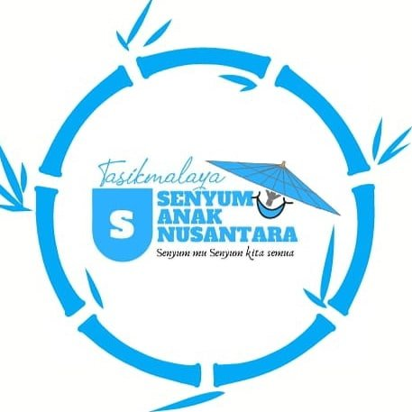
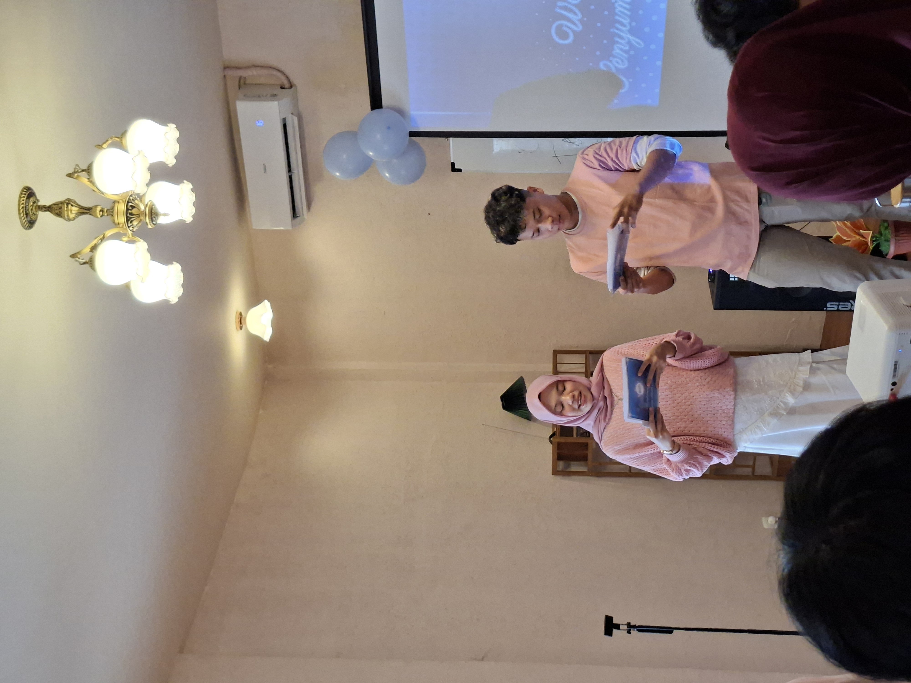

<div align="center">

  

  # SAN CHAPTER TASIKMALAYA
  ### *Platform Resmi Pemuda, Pelestarian Budaya & Inovasi Sosial Kota Tasikmalaya*

  <p align="center">
    Website resmi organisasi kepemudaan <strong>San Chapter Tasikmalaya</strong> yang dibangun dengan gaya desain <strong>Neo-Brutalism</strong> berkinerja tinggi, interaktif, dan terintegrasi secara dinamis dengan MongoDB Atlas.
  </p>

  <!-- Badges -->
  <p align="center">
    
    
    
    
    
    
    
    
  </p>

  <p align="center">
    <a href="#pratinjau-antarmuka-aplikasi"><strong>Pratinjau Antarmuka</strong></a> •
    <a href="#tentang-proyek"><strong>Tentang</strong></a> •
    <a href="#fitur-unggulan"><strong>Fitur</strong></a> •
    <a href="#arsitektur--tech-stack"><strong>Tech Stack</strong></a> •
    <a href="#panduan-deployment-ke-vercel-upload-envlocal"><strong>Panduan Vercel (.env.local)</strong></a> •
    <a href="#menjalankan-secara-lokal-local-development"><strong>Local Setup</strong></a>
  </p>

</div>

---

## Pratinjau Antarmuka Aplikasi

Bagian ini menyajikan gambaran visual layar antarmuka utama pada website **SAN Chapter Tasikmalaya**, meliputi panel **Dashboard Admin**, **Halaman Login**, dan **Manajemen Berita**.

> [!NOTE]
> Simulator demo interaktif mandiri tersedia di [`interactive_demo.html`](./interactive_demo.html) (atau buka `/demo.html` saat menjalankan server lokal). Dokumentasi teknis lengkap tersedia di [`DEMO_SHOWCASE.md`](./DEMO_SHOWCASE.md).

---

### 1. Tampilan Utama: Dashboard Admin (`/admin`)

Tampilan awal panel pengurus dengan banner neubrutalisme kuning tebal, informasi akun terautentikasi responsif, badge `MONGODB` satu baris, dan kartu metrik riil dari database.

```text
+---------------------------------------------------------------------------------------+
| [PORTAL KEPENGURUSAN]  [MONGODB]                                                      |
| Dashboard Panel Pengurus                                                              |
| Pusat kendali warta, direktori pengurus, dan galeri kegiatan SAN Tasikmalaya          |
|                                                                                       |
|   [AKUN LOGIN SAAT INI:]                                                              |
|   muhammadusamahabdurrahman@gmail.com  [ SUPER ADMIN ]                                |
+---------------------------------------------------------------------------------------+

+--------------------+  +--------------------+  +--------------------+  +---------------+
| WARTA BERITA       |  | DIREKTORI ANGGOTA  |  | GALERI SLIDESHOW   |  | AUDIT LOG     |
| 3                  |  | 0                  |  | 20                 |  | Aktif         |
| Database Terkoneksi|  | Siap Ditambahkan   |  | Foto Dokumentasi   |  | Terverifikasi |
+--------------------+  +--------------------+  +--------------------+  +---------------+

AKSES CEPAT MENU PENGELOLAAN:
[ Manajemen Berita → ]  [ Direktori Pengurus → ]  [ Galeri Slideshow → ]  [ Pengaturan → ]
```

- **Email Panjang Terproteksi**: Menggunakan `truncate max-w-[190px] sm:max-w-md` dan tooltip agar teks email panjang tidak keluar dari batas kartu pada perangkat seluler.
- **Badge Akses 1 Baris**: Badge `SUPER ADMIN` dikunci dengan `whitespace-nowrap shrink-0` sehingga tidak akan terbelah menjadi 2 baris.
- **Badge Database Padat**: Diringkas seragam menjadi `[ MONGODB ]` menggantikan teks lama yang memakan 3 baris.
- **Metrik Bebas Data Palsu**: Grafik dan kartu statistik hanya menyajikan data riil tanpa angka palsu, dilengkapi *timeout guard* 4 detik untuk mencegah *infinite loading*.

---

### 2. Tampilan Halaman Login (`/login` & `/admin/login`)

Pintu masuk tunggal yang ramah pengguna. Tidak ada lagi penolakan akses yang kaku atau instruksi ganti akun Google yang membingungkan.

```text
+-------------------------------------------------------------------+
|                              [ SAN ]                              |
|                                                                   |
|                    Portal Masuk Sistem                            |
|             SAN Chapter Tasikmalaya - Pengurus & Anggota          |
|                                                                   |
|  +-------------------------------------------------------------+  |
|  | [STATUS] Akses Masuk Terbuka & Ramah                        |  |
|  | Setiap akun Google yang masuk diakui secara sah. Hak akses  |  |
|  | dan pengalihan halaman disesuaikan secara otomatis.         |  |
|  +-------------------------------------------------------------+  |
|                                                                   |
|  +-------------------------------------------------------------+  |
|  |   [G] Masuk dengan Akun Google                              |  |
|  +-------------------------------------------------------------+  |
|                                                                   |
|  ALUR PENGALIHAN BERBASIS PERAN (RBAC):                           |
|  • Super Admin / Admin  : Otomatis masuk ke /admin (Dashboard)   |
|  • Member Reguler / Tamu: Dialihkan ke / (Beranda Utama)          |
+-------------------------------------------------------------------+
```

#### Menu Dropdown Profil di Header (Setelah Login):
```text
+-----------------------------------------------------------------------------+
| [SAN] Tasikmalaya      Beranda   Berita   Anggota    [ (Avatar) M. Usamah ▼ ]|
+-----------------------------------------------------------------------+-----+
                                                                        |
                                         +------------------------------v---+
                                         | [INFO] M. Usamah Abdurrahman     |
                                         |        muhammadusamah...@gmail...|
                                         |        [ SUPER ADMIN ]           |
                                         +----------------------------------+
                                         | Dashboard Admin               →  |
                                         | Beranda Utama                    |
                                         | Berita & Kegiatan                |
                                         | Jajaran Pengurus                 |
                                         +----------------------------------+
                                         | [ Keluar (Logout) ]              |
                                         +----------------------------------+
```

---

### 3. Tampilan Manajemen Berita (`/admin/berita`)

Pusat publikasi warta kegiatan, aksi sosial, dan kabar resmi organisasi.

```text
+---------------------------------------------------------------------------------------+
| Kelola Berita & Publikasi Warta                               [ + Tambah Berita Baru ]|
| Arsip kegiatan, bakti sosial, dan siaran pers organisasi SAN Tasikmalaya              |
|                                                                                       |
| Kategori: [ Semua (3) ]  [ Kegiatan ]  [ Organisasi ]  [ Sosial ]                     |
+---------------------------------------------------------------------------------------+

DAFTAR ARTIKEL WARTA:
+---------------------------------------------------------------------------------------+
| [FOTO]  [KEGIATAN] 12 Sep 2026                                                        |
|         Bakti Sosial & Edukasi Pembinaan Anak Tasikmalaya                             |
|                                                     [ Lihat ]  [ Edit ]  [ Hapus ]    |
+---------------------------------------------------------------------------------------+
| [FOTO]  [ORGANISASI] 08 Sep 2026                                                      |
|         Musyawarah Kerja Pengurus SAN Chapter Tasikmalaya                             |
|                                                     [ Lihat ]  [ Edit ]  [ Hapus ]    |
+---------------------------------------------------------------------------------------+
| [FOTO]  [SOSIAL] 01 Sep 2026                                                          |
|         Penyaluran Bantuan Sembako Bersama Komunitas Relawan                          |
|                                                     [ Lihat ]  [ Edit ]  [ Hapus ]    |
+---------------------------------------------------------------------------------------+
```

---

### 4. Fitur Pelengkap: Modal Crop & Zoom Foto (Gaya Discord)

Utilitas interaktif yang otomatis muncul saat admin mengunggah berkas foto di form Pengurus, Galeri, atau Berita:

```text
+-------------------------------------------------------------------------+
| [CROP] Sesuaikan & Edit Foto                                      [ X ] |
+-------------------------------------------------------------------------+
|                                                                         |
|   +-----------------------------------------------------------------+   |
|   |                        AREA KANVAS GAMBAR                       |   |
|   |                      (Bisa digeser / drag)                      |   |
|   |                                                                 |   |
|   |                    Bingkai Crop:                                |   |
|   |                    - Lingkaran 1:1 (Avatar Pengurus Discord)    |   |
|   |                    - Persegi 16:9 (Sampul Berita & Galeri)      |   |
|   +-----------------------------------------------------------------+   |
|                                                                         |
|   Zoom: [----O-------------------------] [ 130% ]                       |
|   [ Putar 90° ]  [ Reset Posisi ]                                       |
|                                                                         |
+-------------------------------------------------------------------------+
|                                      [ Batal ]  [ Terapkan (Apply) ]    |
+-------------------------------------------------------------------------+
```

---

### 5. Pratinjau Halaman Beranda Publik

<div align="center">
  
  <p><sub><em>Tampilan Beranda Publik: Hero Section Dinamis, Slideshow Galeri Resolusi Tinggi, dan 3 Pilar Gerakan Pemuda</em></sub></p>
</div>

---

## Tentang Proyek

**San Chapter Tasikmalaya** adalah platform digital komprehensif yang dirancang untuk memperkuat transparansi publik, publikasi warta kegiatan, dan keanggotaan pemuda di Kota Tasikmalaya, Jawa Barat. 

Dibangun menggunakan arsitektur mutakhir **Next.js 16 (App Router + Turbopack)** dan **React 19**, website ini menyajikan kecepatan render instan, keamanan berlapis, tata letak ramah perangkat seluler (*mobile-first*), serta sistem pembaruan konten dinamis (*on-demand cache revalidation*).

---

## Fitur Unggulan

### 1. Pengalaman Publik (Public-Facing Experience)
- **Beranda Interaktif**: Transisi halus antar section, slideshow foto dokumentasi, dan highlight program kerja.
- **Katalog Warta & Berita (`/berita`)**: Halaman penelusuran artikel berita dengan pencarian instan, filter kategori, kartu responsif, dan *dynamic route reader* (`/berita/[slug]`).
- **Galeri Multi-Image Terpadu**: Pratinjau foto kegiatan dengan dukungan Google Drive & Cloudinary.
- **Direktori Pengurus & Anggota (`/anggota`)**: Tampilan kartu profil anggota yang rapi dengan fitur *smart face-crop* dan tombol kontak langsung (WhatsApp, Instagram, LinkedIn, Email).
- **Dark Mode Immunity**: Sistem tata warna independen dengan penegasan kontras penuh (`color-scheme: light;` & `#000000`) mencegah teks redup atau terhapus di perangkat pengguna dengan tema gelap.

### 2. Panel Manajemen & Keamanan (Admin & RBAC System)
- **Multi-Provider Authentication**: Otentikasi aman melalui Google OAuth 2.0 dan Demo Credentials untuk kebutuhan pengujian.
- **Hierarki Peran (Role-Based Access Control)**:
  - **Super Admin**: Akses penuh sistem, manajemen akun pengurus (undang via email, mutasi role, pencabutan izin), konfigurasi sosial media, dan audit log IP.
  - **Admin / Editor**: Diberikan fokus akses untuk mengelola berita, foto dokumentasi kegiatan, dan direktori pengurus.
- **Pembaruan Data Instan (Cache Revalidation)**: Pemanfaatan `revalidatePath` di Next.js Server Actions memastikan konten yang ditambah, diubah, atau dihapus langsung terbit detik itu juga tanpa perlu restart server.
- **Analisis & Audit Log**: Monitoring visual grafik aktivitas, pembaca artikel, dan riwayat aktivitas pengurus.

---

## Arsitektur & Tech Stack

| Lapisan | Teknologi | Versi | Peran & Deskripsi |
| :--- | :--- | :--- | :--- |
| **Framework** | [Next.js](https://nextjs.org/) | `16.3.4` | App Router, Server Actions, Dynamic Routes, Turbopack Engine |
| **UI Library** | [React](https://react.dev/) | `19.2.8` | Server Components, Suspense, Concurrent Features |
| **Styling** | [Tailwind CSS](https://tailwindcss.com/) | `v4` | Desain Neo-Brutalism, Utilitas CSS modern, Responsivitas Mobile |
| **Animasi** | [Framer Motion](https://www.framer.com/motion/) | `13.2` | Page transitions fluid (`easeInOutCubic`), scroll reveals, hover interactions |
| **Basis Data** | [MongoDB Atlas](https://www.mongodb.com/atlas) | `Mongoose 9` | Skema basis data terstruktur untuk News, Members, Users, Settings, & Audit |
| **Otentikasi** | [NextAuth.js](https://next-auth.js.org/) | `v4.24` | Session management berbasis JWT, Google Provider, RBAC Middleware |
| **Media Cloud** | [Cloudinary](https://cloudinary.com/) | `v2.11` | Optimasi dan pengunggahan aset gambar digital |
| **Image Cropper** | [react-easy-crop](https://github.com/ValentinH/react-easy-crop) | `5.5` | Cropper interaktif modal dengan zoom & rotasi gaya Discord |
| **Ikonografi** | [Lucide React](https://lucide.dev/) | `v1.43` | Ikon vektor konsisten dan elegan |
| **Visualisasi** | [Recharts](https://recharts.org/) | `v3.10` | Grafik statistik metrik pengunjung di dashboard internal |

---

## Panduan Deployment ke Vercel (Upload `.env.local`)

Repositori ini telah disiapkan agar dapat di-deploy ke **[Vercel](https://vercel.com)** secara langsung. Seluruh variabel lingkungan telah dikonsolidasikan ke dalam **satu berkas utama**, yaitu `.env.local`.

### Langkah-langkah Deployment:

1. **Import Repositori ke Vercel**:
   - Masuk ke dashboard [Vercel](https://vercel.com) dan pilih **Add New Project**.
   - Hubungkan ke repositori GitHub proyek ini.

2. **Upload / Import Berkas `.env.local`**:
   - Di dashboard Vercel, masuk ke bagian **Environment Variables**.
   - Vercel menyediakan opsi **Drag and Drop / Upload `.env`**. Cukup tarik atau unggah berkas `.env.local` Anda langsung ke kotak tersebut.
   - Vercel akan otomatis membaca dan mengisi seluruh 10 pasangan variabel berikut:

| Nama Variabel | Keterangan & Tindakan di Vercel |
| :--- | :--- |
| `MONGODB_URI` | String koneksi basis data MongoDB Atlas *(Sudah terisi)* |
| `NEXTAUTH_URL` | **Ubah nilainya ke URL domain Vercel Anda** *(contoh: `https://websantasik.vercel.app`)* |
| `NEXTAUTH_SECRET` | Kunci enkripsi sesi NextAuth *(Sudah terisi)* |
| `GOOGLE_CLIENT_ID` | Client ID Google OAuth dari Google Cloud Console *(Sudah terisi)* |
| `GOOGLE_CLIENT_SECRET` | Client Secret Google OAuth *(Sudah terisi)* |
| `SUPER_ADMIN_EMAILS` | Daftar email super admin dipisah koma *(Sudah terisi)* |
| `ALLOWED_ADMIN_EMAILS`| Daftar email admin/editor reguler *(Sudah terisi)* |
| `CLOUDINARY_*` | Kredensial media storage Cloudinary *(Sudah terisi)* |

> [!TIP]
> **Penting untuk Google OAuth di Vercel**:
> Tambahkan URL Callback domain Vercel Anda ke dalam **Google Cloud Console > APIs & Services > Credentials > Authorized redirect URIs**:
> `https://<domain-anda>.vercel.app/api/auth/callback/google`

3. **Klik "Deploy"**:
   - Vercel akan otomatis menjalankan `next build` dan membangun seluruh 17 halaman statis maupun dinamis.
   - Domain gambar eksternal di `next.config.ts` sudah siap untuk Vercel.

---

## Menjalankan Secara Lokal (Local Development)

Bagi pengembang yang ingin menjalankan proyek ini di lingkungan lokal:

### 1. Klon Repositori
```bash
git clone https://github.com/usamah-io/websantasik.git
cd websantasik
```

### 2. Pasang Dependensi
```bash
npm install
```

### 3. Konfigurasi Lingkungan (`.env.local`)
Pastikan berkas `.env.local` sudah berada di direktori utama dengan `NEXTAUTH_URL=http://localhost:3000`.

### 4. Jalankan Server Pengembangan
```bash
npm run dev
```
Buka peramban Anda di [http://localhost:3000](http://localhost:3000).

### 5. Pengujian Build Produksi
Untuk memastikan tidak ada kesalahan kompilasi sebelum rilis:
```bash
npm run lint
npm run build
```

---

## Struktur Proyek

```text
websantasik/
├── public/
│   ├── images/
│   │   ├── foto1.jpg s/d foto20.jpg   # 20 Foto dokumentasi resmi resolusi tinggi
│   │   └── preview-landing.png        # Screenshot pratinjau halaman beranda publik
│   ├── demo.html                      # Simulator demo interaktif (bisa dibuka di browser)
│   └── logo.png                       # Logo resmi San Chapter Tasikmalaya
├── src/
│   ├── app/
│   │   ├── actions/                   # Next.js Server Actions (News, Member, User, Gallery)
│   │   ├── admin/                     # Dashboard & Manajemen Internal (RBAC Protected)
│   │   ├── anggota/                   # Halaman Publik Direktori Pengurus
│   │   ├── berita/                    # Halaman Publik Katalog & Reader Berita
│   │   ├── layout.tsx                 # Root Layout & Provider
│   │   └── page.tsx                   # Halaman Beranda Publik Utama
│   ├── components/
│   │   ├── admin/                     # Komponen Dashboard & Chart Internal
│   │   ├── layout/                    # Navbar, Footer, PageTransition Wave
│   │   └── ui/                        # RetroCard, RetroButton, Badge, ImageCropperModal
│   └── lib/
│       ├── auth.ts                    # Konfigurasi NextAuth.js & RBAC Guard
│       ├── cropImage.ts               # Utilitas crop HTML5 Canvas
│       ├── mongodb.ts                 # Koneksi & Caching MongoDB Mongoose
│       └── models/                    # Schema Mongoose (News, Member, User, Settings)
├── DEMO_SHOWCASE.md                   # Dokumentasi tampilan demo antarmuka
├── interactive_demo.html              # Standalone interactive demo HTML
├── .env.local                         # File konfigurasi Environment Variables utama
├── next.config.ts                     # Konfigurasi Next.js & Remote Image Patterns
└── package.json                       # Dependensi proyek
```

---

## Kanal Resmi Organisasi

Mari terhubung dan berkolaborasi bersama pemuda Tasikmalaya:

- **Instagram**: [@san.tasikmalaya.2020](https://www.instagram.com/san.tasikmalaya.2020/)
- **YouTube**: [@sanchaptertasikmalaya3661](https://www.youtube.com/@sanchaptertasikmalaya3661)
- **Email Resmi**: [san.tasikmalaya.2020@gmail.com](mailto:san.tasikmalaya.2020@gmail.com)

---

<div align="center">
  <sub>Dikelola dengan bangga oleh <strong>Tim IT & Media San Chapter Tasikmalaya</strong>. &copy; 2026 Seluruh hak cipta dilindungi.</sub>
</div>
